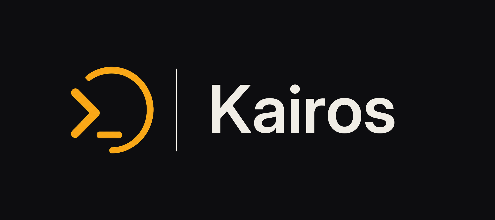

<div align="center">



**A fully local, governance-ready terminal — your AI, your agents, your rules, your machine.**

Kairos is a fork of [Warp](https://github.com/warpdotdev/warp) (via
[OpenWarp](https://github.com/zerx-lab/openwarp)) that strips all mandatory
cloud dependencies, wires in [specsmith](https://github.com/BitConcepts/specsmith)
as a local AI governance engine, and opens the AI provider layer to any
OpenAI-compatible endpoint.

> **v0.1.0-alpha** — Early access release. Not production-ready. **Not affiliated with Warp, Inc.**

</div>

---

## What Kairos is

Upstream Warp requires a Warp account, Warp's cloud servers, and Warp's AI gateway.
Kairos removes all of that and replaces it with a locally-governed stack:

| | Upstream Warp | Kairos |
| --- | --- | --- |
| Cloud dependency | Hard dependency on Warp backend | **Zero — no account, no login, no cloud calls** |
| AI governance | Warp cloud + opaque server rules | **[specsmith](https://github.com/BitConcepts/specsmith) local governance engine** |
| AI provider | Warp gateway only | **Any OpenAI-compatible endpoint, BYOE** |
| Default BYOE endpoint | `warp.dev` servers | **`http://127.0.0.1:7700` (local specsmith)** |
| Credentials | Cloud account | **Local config, never leaves the device** |
| Bug reporting | Warp feedback form | **GitHub Issues: kairos or specsmith repo** |
| Blocks / Workflows / Keymaps | Kept | **Fully preserved** |
| Terminal core | Full Warp UX | **Full Warp UX** |
| License | AGPL-3.0 / MIT dual | **Same (see [LICENSE](LICENSE))** |

## How it works

**01 · specsmith governance-serve starts locally**
At launch, Kairos spawns `specsmith governance-serve` as a managed child process
on port 7700. This is the local AI governance backend — preflight checks,
verification, confidence scoring, and audit all run on your machine.

**02 · BYOE wired to localhost by default**
The AI provider endpoint defaults to `http://127.0.0.1:7700/v1/`. Point it
at any OpenAI-compatible endpoint in Settings → AI if you want a different
model or provider. Credentials are stored locally only.

**03 · Full Warp terminal experience, zero cloud**
Blocks, Workflows, AI agent sessions, themes, keymaps, SSH manager — all
the Warp UX you know, running entirely offline without any server dependency.

## Core features

- **Local AI governance** — [specsmith](https://github.com/BitConcepts/specsmith)
  runs preflight and verification checks locally before and after every governed action
- **BYOE** — any OpenAI Chat Completions-compatible endpoint works out of the box;
  6 native protocols via [genai](https://github.com/jeremychone/rust-genai)
- **Zero forced login** — `skip_login` is always active; no Warp account required
- **Zero telemetry** — all analytics, crash uploads, and experiment flags disabled
- **EU AI Act / NIST AI RMF compliance** — cryptographic audit log, AI disclosure,
  human escalation, kill-switch, least-privilege permissions, and compliance export
  (see [specsmith compliance docs](https://github.com/BitConcepts/specsmith#ai-compliance--governance))
- **Governance Tools Panel** — Settings → Governance surfaces live compliance controls,
  context window settings, permission profiles, and the kill-switch per session/project
- **Per-project shell memory** — shell preference is saved to `.kairos/shell-pref.json`
  so every new tab in a project opens the same shell you last chose
- **Context window fill indicator** — live progress bar in the agent footer shows current
  context fill percentage; auto-compression fires at 80%; hard 15% ceiling enforced
- **Bug reporting via GitHub Issues** — bug links in the Governance page open directly
  in the browser: terminal bugs → [kairos](https://github.com/BitConcepts/kairos/issues),
  AI/governance bugs → [specsmith](https://github.com/BitConcepts/specsmith/issues)
- **Gruvbox Dark default theme** — new users start with Gruvbox Dark instead of the
  Kairos Amber theme (still available in Settings → Themes)
- **SSH Integration** — block-based input and shell integration for SSH sessions
  (previously called "Warpify"; all user-visible strings updated)
- **Full Warp UX preserved** — Blocks, Workflows, AI commands, Keymaps, SSH manager,
  themes, split panes, MCP client — all kept and working

---

## AI Compliance & Governance

Kairos is the UI surface for specsmith's full compliance stack. All compliance enforcement
happens inside specsmith; Kairos surfaces the controls and status.

### Governance Tools Panel

**Settings → Governance** is the central compliance dashboard for the active session:

- **specsmith status** — live version, health, and update availability
  (checks pipx → pip → pip3, with clickable update buttons)
- **Permission profile** — view and change the active least-privilege preset
  (`read_only` / `standard` / `extended` / `admin`) or set custom allow/deny lists
- **Escalation threshold** — the confidence level below which Kairos asks for
  human confirmation before executing a governed action
- **Kill-switch** — immediately terminates all active agent sessions and writes
  a kill event to the project `LEDGER.md`; satisfies EU AI Act Art. 14 §4
- **Audit log viewer** — live tail of `.specsmith/trace.jsonl` with chain
  integrity status (green = intact, red = tampered)
- **Context window** — Ollama `num_ctx` recommendation based on detected GPU VRAM,
  compression threshold, and auto-compress toggle
- **Bug report links** — clickable links that open the correct GitHub Issues repo
  in the system browser (terminal bugs vs. AI/governance bugs routed separately)

Compliance settings cascade: global defaults in `~/.specsmith/config.yml`, then
per-project `.specsmith/config.yml`, then per-session overrides in the panel.
Changes in the panel can be written back to the per-project config.

### Compliance Standards Met

Kairos + specsmith together implement:

**EU AI Act (Regulation 2024/1689)**
- Art. 9 — Risk Management: AEE verification loop with confidence scoring
- Art. 12 — Logging: SHA-256 chained `TraceVault` (tamper-evident, append-only)
- Art. 13 — Transparency: `ai_disclosure` in every preflight response
- Art. 14 — Human Oversight: escalation threshold + kill-switch
- Art. 15 — Robustness: bounded retry, confidence gates, hard context ceiling
- Art. 53 — GPAI Transparency: provider + model name in every AI response

**NIST AI RMF 1.0**
- GOVERN: H1–H22 governance rules (H1–H14 engineering + H15–H22 OEA anti-hallucination), permission profiles, per-project policy
- MAP: AEE stress-test, belief graph, contradiction and uncertainty metrics
- MEASURE: confidence scoring, epistemic equilibrium, `specsmith epistemic-audit`
- MANAGE: kill-switch, escalation, bounded retry, safe-write backup, deny-list guardrails

See [specsmith's compliance documentation](https://github.com/BitConcepts/specsmith#ai-compliance--governance)
for the full breakdown of each mechanism.

---

## Per-Project Shell Memory

Kairos remembers the shell you use in each project. When you open a new tab with an
explicit shell (right-click → New Tab With Shell), that choice is saved to
`.kairos/shell-pref.json` at the project root:

```json
{ "shell": { "WSL": "Ubuntu-24.04" } }
```

Subsequent new tabs in the same project automatically open that shell — no global
setting is changed. The project root is detected by walking up from the current
directory until `.git`, `.kairos`, or `scaffold.yml` is found.

Supported shell variants: system default, executable path, WSL distro, MSYS2, custom.

---

## Context Window Management

Kairos shows real-time context usage and handles overflow automatically via specsmith.

**Fill indicator** — a compact progress bar in the agent footer shows current fill
as a percentage. Color transitions: green → yellow at 80%, red at the hard ceiling.

**Auto-compression** — when fill reaches the compression threshold (default 80%),
Kairos fires `SummarizeAIConversation` before the next agent turn. The conversation
is condensed to a summary that preserves key decisions and context.

**Hard ceiling** — a 15% reservation (minimum 2,048 tokens) is always held back.
Fill cannot reach 100% — if it would, `ContextFullError` is raised and emergency
compression runs first. This is a safety invariant, not a setting.

**GPU-aware sizing** — the Governance panel shows the recommended `num_ctx` for
your Ollama setup based on detected NVIDIA or AMD GPU VRAM:

| VRAM | Recommended Context |
|---|---|
| < 6 GB | 4,096 tokens |
| 6–11 GB | 8,192 tokens |
| 12–19 GB | 16,384 tokens |
| 20 GB+ | 32,768 tokens |

## Verified AI providers

| Provider | Base URL | Notes |
| --- | --- | --- |
| **specsmith (local)** | `http://127.0.0.1:7700/v1` | Default — governance-aware local endpoint |
| **OpenAI** | `https://api.openai.com/v1` | Direct |
| **Anthropic** | via genai native | Claude family |
| **DeepSeek** | `https://api.deepseek.com/v1` | thinking + tool calling |
| **Gemini** | via genai native | Google AI Studio |
| **Ollama** | `http://localhost:11434/v1` | Local inference, no key |
| **OpenRouter** | `https://openrouter.ai/api/v1` | Aggregator gateway |

## Build from source

Requires: **Rust 1.92+** (via [rustup](https://rustup.rs)), **protoc** (for proto API crates).

```bash
git clone https://github.com/BitConcepts/kairos
cd kairos
./script/bootstrap   # platform-specific deps (macOS/Linux)
./script/run         # build & run
./script/presubmit   # fmt / clippy / tests
```

Windows: install deps via winget first:
```powershell
winget install Rustlang.Rustup
winget install Google.Protobuf
```

Always target the `kairos` binary explicitly:
```bash
cargo build --release --bin kairos
cargo run   --release --bin kairos
```

**Windows shortcut** — a convenience script is included at the repo root:
```powershell
.\Open-Kairos.ps1          # debug build + launch
.\Open-Kairos.ps1 -Release # release build + launch
.\Open-Kairos.ps1 -NoBuild # skip build, run last compiled binary
```

> Do not run `cargo build --release --bin {warp,stable,dev,preview}` — those
> entry points require Warp's private `warp-channel-config` binary and will
> panic at startup. Use `kairos` only.

See [DEVELOPMENT.md](DEVELOPMENT.md) for the full engineering guide.

## License

Kairos inherits the dual-license structure from Warp. See [LICENSE](LICENSE)
for the full breakdown:

- `crates/warpui_core` / `crates/warpui` — [MIT](LICENSE-MIT)
  (Copyright 2020-2026 Denver Technologies, Inc.)
- All other upstream Warp code — [AGPL-3.0](LICENSE-AGPL)
  (Copyright 2020-2026 Denver Technologies, Inc.)
- Kairos-specific additions (`crates/kairos-governance`, `specs/`, `.github/`,
  `themes/kairos_amber.yaml`, and files with a BitConcepts copyright header) — MIT
  (Copyright 2026 BitConcepts)

## Contributing

Community contributions welcome. See [CONTRIBUTING.md](CONTRIBUTING.md) for the full flow.

Before filing, please [search existing issues](https://github.com/BitConcepts/kairos/issues).
Security vulnerabilities should be reported privately per
[CONTRIBUTING.md#reporting-security-issues](CONTRIBUTING.md#reporting-security-issues).

## Acknowledgements

Kairos stands on the shoulders of many teams and open-source projects:

**Core foundation**
[Warp](https://github.com/warpdotdev/warp) — the terminal this is forked from, built by Warp, Inc.
[OpenWarp](https://github.com/zerx-lab/openwarp) — the community fork that first removed cloud dependencies, laying the groundwork for Kairos.

**Kairos governance**
[specsmith](https://github.com/BitConcepts/specsmith) — the local AI governance engine powering Kairos.

**Key dependencies**
[genai](https://github.com/jeremychone/rust-genai) · [Tokio](https://github.com/tokio-rs/tokio) · [minijinja](https://github.com/mitsuhiko/minijinja) · [cosmic-text](https://github.com/pop-os/cosmic-text) · [Alacritty VTE](https://github.com/alacritty/vte) · [Hyper](https://github.com/hyperium/hyper) · [reqwest](https://github.com/seanmonstar/reqwest) · [wgpu](https://github.com/gfx-rs/wgpu)
